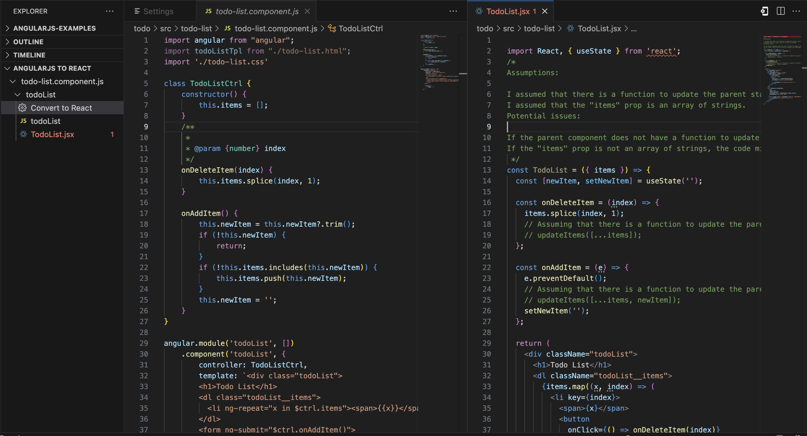

# ng2react (AngularJS to React)

An experimental extension for converting AngularJS to React, leveraging OpenAI's GPT API.

**Early Alpha Release**

## Features

-   **Convert AngularJS Components**: The plugin allows users to easily convert AngularJS components to React components by sending the components to the ng2react core library, which uses TypeScript for parsing AngularJS components and the OpenAI API to generate the React version of the component.



## Requirements

-   **OpenAI API Key**: The plugin requires an OpenAI API key to be set in the `ng2react.apiKey` setting. You can get an API key by signing up for the [OpenAI API](https://beta.openai.com/).

## Extension Settings

This extension contributes the following settings:

-   `ng2react.openai.apiKey`: The OpenAI API key to use for generating React components from AngularJS components.
-   `ng2react.openai.model`: The OpenAI engine to use for generating React components from AngularJS components. Defaults to `gpt-4`.
-   `ng2react.openai.temperature`: The OpenAI temperature to use for generating React components from AngularJS components. Defaults to `0.2`.
-   `ng2react.openai.orginization`: An optional organization ID assiciated with your OpenAI account.
-   `ng2react.angularRoot`: The source root of your AngularJS code. Defaults to `src`.
-   `ng2react.reactRoot`: The source root of your AngularJS code. Defaults to `src`.
-   `ng2react.testRoot`: The source root where React unit tests should be generated
-   `ng2react.testFileSuffix`: Default test file suffix. Defaults to `.test.tsx`.
-   `ng2react.enabled`: Whether or not the extension is enabled. Defaults to `auto`.
-   `ng2react.sandboxMode`: Whether or not to run the extension in sandbox mode. Defaults to `false`.

## Known Issues

This is an early alpha release of the extension. There are many known issues and limitations, including:

-   AI Generated Code: The generated code is not guaranteed to be correct. It is generated by an AI model and may contain bugs.
-   Limited Support: The extension currently only supports converting AngularJS components to React components. It does not support converting AngularJS services, directives, or other types of AngularJS code.

## Release Notes

Users appreciate release notes as you update your extension.

### 0.1.0

-   Replaced `ng2react.sourceRoot` property with `ng2react.angularRoot` and `ng2react.reactRoot`
-   Fixed default entry for `ng2react.openai.orginization`

## Wrapping React Components

A [support library is availabe for wrapping React components in AngularJS](https://www.npmjs.com/package/@ng2react/support)components. This library may not have long-term support, but you are free to use, fork, or copy whatever you like from it.

### Installation

```bash
npm install --save @ng2react/support
```

### Usage

#### Convert your AngularJS component or directive to React

You may do this manually or with the help of the [ng2react vscode extension](https://marketplace.visualstudio.com/items?itemName=maxbilbow.ng2react-vscode)

```jsx
// React Component
import React, { useState } from 'react';
import { useService, NgTranslate } from '@ng2react/support';

const MyReactComponent = ({ title, myController }) => {
    const myService = useService('myService');
    const [state, setState] = useState(myService.getState());
    return (
        <>
            <h1>{title}</h1>
            <p>{state}</p>
            <p>
                <NgTranslate id={'TRANLATED_TEXT_ID'} substitutions={myController.getValue()} />
            </p>
        </>
    );
};
```

#### Wrap your React component

```js
// AngularJS Component
import * as angular from 'angular';
import { angularize } from '@ng2react/support';
import { MyReactComponent } from './MyReactComponent.jsx';

const myApp = angular.module('myApp', []);
angularize(MyReactElement, {
    module: myApp,
    name: 'myAngularComponent',
    bindings: {
        title: '@',
    },
    require: {
        myController: '^myController',
    },
    replace: true,
});
```
